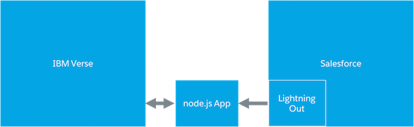

# salesforce-ibm-verse

This example application showcases how to use Salesforce Lightning in combination with the IBM Verse Extensibility API.

The [IBM Verse Extensibility API](https://ibmcnxdev.github.io/verse-developer-chrome-ext/) gives access to the context of a selected mail (_read_ or _new_ mode) or a persons details. You'll find the documentation of the available capabilities in the vendors documentation.

The code in this repo and the linked resources showcase how you can leverage the capabilities i. e. to log existing emails from Verse as an activity to a Salesforce Account objects.

This image showcases the setup:

<center></center>

The IBM Verse application sends a JSON object of the mail data to a node.js app running on Heroku. The node.js app is also the host for a [Salesforce Lightning Out](https://developer.salesforce.com/docs/atlas.en-us.lightning.meta/lightning/lightning_out.htm) application. The sent JSON object gets passed to the Lightning Out component which then logs the email to a selected Account object.

Checkout this video to see how the integration works and how it has been built.

[](http://www.youtube.com/watch?v=yoqrUIpZerw "Salesforce Lightning and IBM Verse")


## Live application

You can find the application on https://salesforce-ibm-verse.herokuapp.com/verse. For using it you'll need an existing Salesforce account (i. e. a Developer Edition) with the below mentioned pre-requisites.


# Run-On-Your-Own

## Prerequisites

For running the app on your own you'll need to fulfill the following requirements:

* Access to a Salesforce org, i. e. a Developer Edition (You can [signup here for free](https://developer.salesforce.com/signup) if you don't have one).
* A Connected App [set up](https://help.salesforce.com/apex/HTViewHelpDoc?id=connected_app_create.htm) in the Salesforce Org.
* A [CORS definition](https://developer.salesforce.com/docs/atlas.en-us.chatterapi.meta/chatterapi/extend_code_cors.htm) for the remote HTML application.

For local development I highly recommend to install the [Heroku Toolbelt](https://toolbelt.heroku.com/).

## Components

The project consists out of three components:

* The node.js app (using EJS)
* The Verse Extension configuration

## Automatic deployment to Heroku

The easiest way to test the application on your own is deploying it to [Heroku](https://www.heroku.com) via the Deploy button.

[](https://heroku.com/deploy)

After the deployment you've to enter in the Heroku UI your Connected App's clientId and clientSecret for the OAuth2 authentication process and also the host URL for the IBM Verse server.

## Local development

Clone this repo.

```
git clone https://github.com/muenzpraeger/salesforce-ibm-verse
```

Create in the root of the project a file _.env_ as described [here](https://devcenter.heroku.com/articles/heroku-local#set-up-your-local-environment-variables) for storing the Heroku environment variables.

Then add the following key/value pairs to the _.env_ file.

```
OAUTH_CONSUMER_KEY=your-key-from-salesforce
OAUTH_CONSUMER_SECRET=your-secret-from-salesforce
VERSE_SOURCE_SERVER=your-verse-server-dns-name
```

The OAUTH_xxx parameters are for used for storing the Connected App OAuth keys. The VERSE_SOURCE_SERVER parameter is used within the node.js app to [prevent cross-site-scripting](https://ibmcnxdev.github.io/verse-developer-chrome-ext/reference/reference.html#security) from other sites, so set it to the DNS name of your Verse server.

Now start the app via the Heroku Toolbelt.

```
heroku local web
```

## Development

If you want to develop with this code you can do it with any text editor of your choice. ;-)


## License

For licensing see the included [license file](https://github.com/muenzpraeger/salesforce-ibm-verse/blob/master/LICENSE.md).